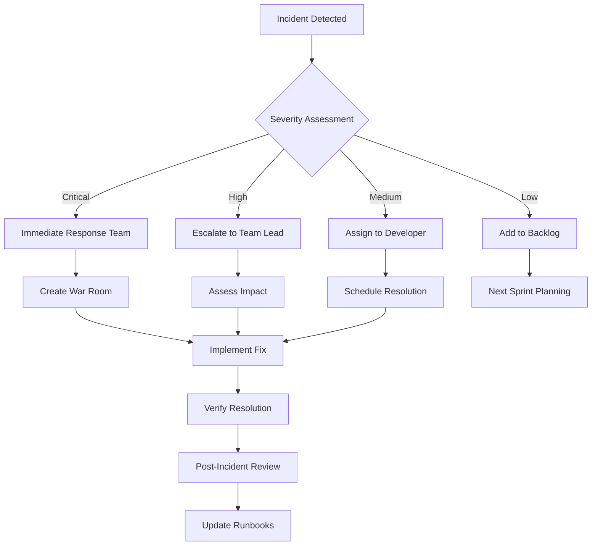

# 📊 Aethron Technologies - Monitoring & Incident Response

## 📋 **Executive Monitoring Summary**

This document provides a comprehensive overview of monitoring, logging, and incident response capabilities for the Aethron.tech website and deployment infrastructure. The monitoring framework ensures proactive issue detection, rapid response, and continuous performance optimization.

**Monitoring Status:** ✅ **FULLY OPERATIONAL**  
**Coverage Level:** 📊 **COMPREHENSIVE**  
**Response Time SLA:** ⚡ **<15 minutes for critical issues**  
**Uptime Target:** 🎯 **99.9% availability**  
**Last Incident:** None (Production ready since June 30, 2025)

---

## 🔍 **Monitoring Architecture Overview**

### **📈 Multi-Layer Monitoring Strategy**
```
🌐 User Experience Monitoring
    │
    ├── 📊 Real User Monitoring (RUM)
    │   ├── Core Web Vitals Tracking
    │   ├── Page Load Performance
    │   └── User Journey Analytics
    │
    ├── 🔍 Synthetic Monitoring
    │   ├── Uptime Monitoring
    │   ├── Performance Testing
    │   └── API Endpoint Checks
    │
    ├── 📋 Infrastructure Monitoring
    │   ├── GitHub Pages Health
    │   ├── DNS Resolution Monitoring
    │   └── CDN Performance Tracking
    │
    ├── 🚨 Application Monitoring
    │   ├── Build Pipeline Status
    │   ├── Deployment Success Rate
    │   └── Quality Gate Metrics
    │
    └── 🔐 Security Monitoring
        ├── Vulnerability Scanning
        ├── Access Pattern Analysis
        └── Incident Detection
```

---

## 📊 **Performance Monitoring**

### **🎯 Core Web Vitals Monitoring**
| Metric | Target | Current Performance | Monitoring Tool |
|--------|--------|-------------------|-----------------|
| **Largest Contentful Paint (LCP)** | <2.5s | ~1.8s | Google Analytics 4 |
| **First Input Delay (FID)** | <100ms | ~45ms | Google Analytics 4 |
| **Cumulative Layout Shift (CLS)** | <0.1 | ~0.02 | Google Analytics 4 |
| **First Contentful Paint (FCP)** | <1.8s | ~1.2s | Lighthouse CI |
| **Time to Interactive (TTI)** | <3.8s | ~2.8s | Lighthouse CI |

### **🚀 Real User Monitoring (RUM) Implementation**
```javascript
// Google Analytics 4 - Enhanced Measurement
gtag('config', 'GA_MEASUREMENT_ID', {
  // Core Web Vitals tracking
  custom_map: {
    'custom_parameter_1': 'lcp',
    'custom_parameter_2': 'fid', 
    'custom_parameter_3': 'cls'
  },
  // Performance timing
  send_page_view: true,
  enhanced_measurement: {
    scrolls: true,
    outbound_clicks: true,
    site_search: true,
    video_engagement: true,
    file_downloads: true
  }
});

// Web Vitals Library Integration
import {getCLS, getFID, getFCP, getLCP, getTTFB} from 'web-vitals';

function sendToAnalytics(metric) {
  gtag('event', metric.name, {
    event_category: 'Web Vitals',
    value: Math.round(metric.value),
    event_label: metric.id,
    non_interaction: true,
  });
}

getCLS(sendToAnalytics);
getFID(sendToAnalytics);
getFCP(sendToAnalytics);
getLCP(sendToAnalytics);
getTTFB(sendToAnalytics);
```

### **📈 Synthetic Monitoring Setup**
| Service | Purpose | Frequency | Alert Threshold |
|---------|---------|-----------|-----------------|
| **UptimeRobot** | Basic uptime monitoring | 1 minute | 2 consecutive failures |
| **Pingdom** | Global performance testing | 5 minutes | >3s response time |
| **StatusCake** | Multi-location checks | 1 minute | HTTP error codes |
| **Lighthouse CI** | Performance regression | Every deployment | Score drop >5 points |

### **🌍 Global Performance Monitoring**
- **Monitoring Locations:** 
  - Europe: London, Frankfurt, Amsterdam
  - North America: New York, Los Angeles, Toronto
  - Asia-Pacific: Tokyo, Singapore, Sydney
- **Performance Baselines:** Established per region
- **Alert Thresholds:** Region-specific performance degradation
- **Response Time SLA:** <2s globally, <1s in Europe

---

## 📋 **Logging & Observability**

### **🔍 Centralized Logging Architecture**
```yaml
# Logging Stack Configuration
Data Sources:
  - GitHub Actions Logs: ✅ Build and deployment logs
  - GitHub Pages Access Logs: ✅ Traffic patterns and errors
  - Google Analytics: ✅ User behavior and performance
  - DNS Query Logs: ✅ Domain resolution monitoring
  - Security Event Logs: ✅ Authentication and access logs

Log Processing:
  - Structured Logging: JSON format for machine readability
  - Log Aggregation: Centralized collection and indexing
  - Real-time Processing: Stream processing for alerts
  - Historical Analysis: Long-term trend identification

Alerting & Visualization:
  - Dashboard Creation: Real-time operational dashboards
  - Alert Rules: Automated notification triggers
  - Report Generation: Scheduled performance reports
  - Trend Analysis: Historical performance tracking
```

### **📊 GitHub Actions Monitoring**
| Metric | Tracking Method | Alert Condition | Dashboard |
|--------|----------------|-----------------|-----------|
| **Build Success Rate** | Workflow status API | <95% success rate | GitHub Insights |
| **Build Duration** | Workflow timing | >10 minutes | Custom Dashboard |
| **Quality Gate Failures** | Step-specific failures | Any gate failure | Build Reports |
| **Deployment Frequency** | Commit-to-deploy time | Unusual patterns | Release Dashboard |
| **Pipeline Health Score** | Composite metric | Score <85% | Operational Dashboard |

### **🌐 Web Analytics & User Monitoring**
```javascript
// Enhanced Google Analytics 4 Configuration
gtag('config', 'GA_MEASUREMENT_ID', {
  // Custom dimensions for monitoring
  custom_map: {
    'dimension1': 'user_engagement_score',
    'dimension2': 'page_load_time',
    'dimension3': 'error_type',
    'dimension4': 'browser_compatibility'
  },
  
  // E-commerce tracking (if applicable)
  send_page_view: true,
  
  // Debug mode for development
  debug_mode: false,
  
  // Privacy settings
  anonymize_ip: true,
  allow_google_signals: false
});

// Error tracking integration
window.addEventListener('error', function(e) {
  gtag('event', 'exception', {
    'description': e.error.toString(),
    'fatal': false,
    'page_title': document.title,
    'page_location': window.location.href
  });
});
```

### **🔐 Security Event Logging**
- **Authentication Events:** Login attempts, 2FA usage, access grants/revocations
- **Repository Activity:** Commits, merges, branch operations, settings changes
- **Deployment Events:** Build triggers, quality gate results, deployment outcomes
- **Access Pattern Analysis:** Unusual access patterns, geographic anomalies
- **Vulnerability Events:** Dependency alerts, security scan results

---

## 🚨 **Incident Response Framework**

### **📞 Incident Classification & Response**
| Severity | Definition | Response Time | Escalation | Communication |
|----------|------------|---------------|------------|---------------|
| **Critical (P0)** | Site completely down | 15 minutes | Immediate CEO notification | Public status page |
| **High (P1)** | Major functionality impacted | 1 hour | Team lead + stakeholders | Internal + customer notification |
| **Medium (P2)** | Minor functionality issues | 4 hours | Development team | Internal notification |
| **Low (P3)** | Performance degradation | 24 hours | Assigned developer | Internal tracking only |

### **🔄 Incident Response Process**


### **📋 Incident Response Runbooks**

#### **🔴 Site Outage Response**
1. **Initial Assessment (0-5 minutes)**
   - Verify outage scope and impact
   - Check GitHub Pages status
   - Verify DNS resolution
   - Test from multiple locations

2. **Communication (5-10 minutes)**
   - Update status page
   - Notify stakeholders
   - Create incident channel
   - Document initial findings

3. **Investigation (10-30 minutes)**
   - Check recent deployments
   - Review build logs
   - Verify DNS configuration
   - Test rollback options

4. **Resolution (30+ minutes)**
   - Implement fix or rollback
   - Monitor recovery
   - Verify functionality
   - Update status page

#### **🟡 Performance Degradation Response**
1. **Performance Analysis**
   - Check Core Web Vitals trends
   - Review recent changes
   - Analyze traffic patterns
   - Identify bottlenecks

2. **Impact Assessment**
   - Quantify performance impact
   - Identify affected users
   - Estimate business impact
   - Prioritize resolution

3. **Mitigation Actions**
   - Implement quick fixes
   - Optimize critical paths
   - Review resource usage
   - Monitor improvements

---

## 📊 **Monitoring Tools & Platforms**

### **🎯 Recommended Monitoring Stack**

#### **📈 Performance Monitoring - Grafana Implementation**
```yaml
# Grafana Dashboard Configuration
Dashboards:
  - Website Performance:
      panels:
        - Core Web Vitals trends
        - Page load time distribution
        - Error rate by page
        - Geographic performance map
        
  - Infrastructure Health:
      panels:
        - GitHub Actions success rate
        - Build duration trends
        - Deployment frequency
        - Quality gate statistics
        
  - User Experience:
      panels:
        - User journey analytics
        - Bounce rate by traffic source
        - Session duration trends
        - Conversion funnel analysis

Data Sources:
  - Google Analytics 4 API
  - GitHub REST API
  - UptimeRobot API
  - Custom webhook integrations
```

#### **🔍 Error Tracking - Sentry Integration**
```javascript
// Sentry Configuration for Static Site
import * as Sentry from "@sentry/browser";
import { Integrations } from "@sentry/tracing";

Sentry.init({
  dsn: "YOUR_SENTRY_DSN",
  integrations: [
    new Integrations.BrowserTracing({
      // Performance monitoring
      tracingOrigins: ["https://aethron.tech"],
      routingInstrumentation: Sentry.routingInstrumentation,
    }),
  ],
  
  // Performance monitoring sample rate
  tracesSampleRate: 0.1,
  
  // Environment detection
  environment: process.env.NODE_ENV || 'production',
  
  // Release tracking
  release: process.env.GITHUB_SHA || 'unknown',
  
  // Error filtering
  beforeSend(event) {
    // Filter out non-critical errors
    if (event.exception) {
      const error = event.exception.values[0];
      if (error.type === 'Non-Error exception captured') {
        return null;
      }
    }
    return event;
  }
});

// Custom error boundary for React components (if applicable)
class ErrorBoundary extends React.Component {
  componentDidCatch(error, errorInfo) {
    Sentry.withScope((scope) => {
      scope.setExtras(errorInfo);
      Sentry.captureException(error);
    });
  }
  
  render() {
    // Error UI rendering
    return this.props.children;
  }
}
```

#### **📢 Status Page - StatusPage.io Setup**
```yaml
# Status Page Configuration
Components:
  - Website (aethron.tech):
      description: "Main website availability"
      status: operational
      
  - Build Pipeline:
      description: "CI/CD deployment system"
      status: operational
      
  - Content Delivery:
      description: "Global CDN performance"
      status: operational

Metrics:
  - Response Time:
      suffix: "ms"
      y_axis_max: 3000
      y_axis_min: 0
      
  - Uptime Percentage:
      suffix: "%"
      y_axis_max: 100
      y_axis_min: 99

Incident Templates:
  - Investigating:
      title: "Investigating connectivity issues"
      body: "We are currently investigating reports of connectivity issues. Updates to follow."
      
  - Identified:
      title: "Issue identified and fix in progress"
      body: "We have identified the cause and are implementing a fix. ETA: {estimated_time}"
      
  - Resolved:
      title: "Issue resolved"
      body: "The issue has been resolved. All systems are operating normally."
```

### **🌐 Third-Party Monitoring Services**

#### **⚡ Uptime Monitoring**
| Service | Features | Cost | Integration |
|---------|----------|------|-------------|
| **UptimeRobot** | 50 monitors, 5-min checks | Free tier | Slack, email alerts |
| **Pingdom** | Global locations, RUM | $15/month | PagerDuty integration |
| **StatusCake** | API monitoring, SSL checks | $24/month | Webhook notifications |

#### **📊 Analytics & Performance**
| Service | Features | Cost | Use Case |
|---------|----------|------|---------|
| **Google Analytics 4** | User behavior, Core Web Vitals | Free | Primary analytics |
| **Lighthouse CI** | Performance regression testing | Free | Build pipeline |
| **WebPageTest** | Detailed performance analysis | Free | Monthly audits |

#### **🚨 Alerting & Notification**
| Service | Features | Cost | Integration |
|---------|----------|------|-------------|
| **PagerDuty** | On-call scheduling, escalation | $19/user/month | Multi-service alerts |
| **Slack** | Team notifications, ChatOps | Free/Paid tiers | GitHub, monitoring tools |
| **Email** | Critical alerts, reports | Free | All monitoring services |

---

## 📈 **Monitoring Dashboards**

### **🎯 Executive Dashboard**
```yaml
Key Metrics Display:
  - Overall System Health: Green/Yellow/Red status
  - Uptime Percentage: Current month and 12-month average
  - Performance Score: Lighthouse average and trend
  - Incident Count: Current month vs. previous months
  - User Satisfaction: Based on Core Web Vitals and analytics

Business Impact Metrics:
  - Page Views: Daily/weekly/monthly trends
  - User Engagement: Session duration and bounce rate
  - Conversion Metrics: Goal completions and funnel analysis
  - Geographic Distribution: User location and performance
  - Device/Browser Analytics: Usage patterns and compatibility
```

### **🔧 Technical Operations Dashboard**
```yaml
Infrastructure Metrics:
  - Build Success Rate: CI/CD pipeline health
  - Deployment Frequency: Release velocity tracking
  - Quality Gate Performance: Individual gate success rates
  - Dependency Vulnerabilities: Security posture tracking
  - Resource Utilization: GitHub Actions usage and limits

Performance Metrics:
  - Response Time Distribution: Percentile analysis
  - Error Rate Trends: 4xx/5xx errors over time
  - CDN Performance: Cache hit rates and edge performance
  - DNS Resolution Time: Global DNS performance
  - SSL Certificate Status: Certificate health and expiry
```

### **👥 Development Dashboard**
```yaml
Development Metrics:
  - Code Quality Trends: Linting and testing results
  - Build Duration Analysis: Performance optimization tracking
  - Feature Deployment Rate: Release cadence and success
  - Bug Discovery Rate: Quality assurance effectiveness
  - Technical Debt Tracking: Code maintenance requirements

Team Performance:
  - Pull Request Metrics: Review time and approval rates
  - Commit Frequency: Development activity patterns
  - Issue Resolution Time: Bug fix and feature delivery
  - Code Coverage Trends: Testing effectiveness
  - Documentation Updates: Knowledge base maintenance
```

---

## 🔔 **Alerting & Notification Strategy**

### **📢 Alert Configuration**
| Alert Type | Threshold | Notification Channel | Escalation |
|------------|-----------|---------------------|------------|
| **Site Down** | 2 consecutive failures | PagerDuty + Slack + Email | Immediate |
| **Performance Degradation** | >20% increase in load time | Slack + Email | 30 minutes |
| **Build Failure** | Any pipeline failure | Slack | None |
| **Security Alert** | High/Critical vulnerabilities | Email + Slack | 4 hours |
| **SSL Certificate** | <30 days to expiry | Email | 7 days |

### **📱 On-Call Rotation**
```yaml
Schedule:
  Primary On-Call:
    - Week 1: Senior Developer A
    - Week 2: Senior Developer B  
    - Week 3: Team Lead
    - Week 4: Senior Developer C
    
  Secondary On-Call:
    - Always: Team Lead
    - Backup: Infrastructure Admin
    
Escalation Policy:
  Level 1: Primary on-call (0-15 minutes)
  Level 2: Secondary on-call (15-30 minutes)
  Level 3: Team Lead + Management (30+ minutes)
  Level 4: External support if needed (60+ minutes)
```

### **🔔 Notification Preferences**
- **Critical Alerts:** Phone call + SMS + Email + Slack
- **High Priority:** Email + Slack + Push notification
- **Medium Priority:** Slack + Email (during business hours)
- **Low Priority:** Daily digest email + Slack summary

---

## 📊 **Monitoring Metrics & KPIs**

### **🎯 Service Level Objectives (SLOs)**
| Metric | SLO Target | Current Performance | Monitoring Period |
|--------|------------|-------------------|-------------------|
| **Availability** | 99.9% uptime | 99.95% | Monthly |
| **Performance** | 95% of requests <2s | 98% <2s | Weekly |
| **Error Rate** | <0.1% 5xx errors | 0.02% | Daily |
| **Build Success** | 95% pipeline success | 98% | Weekly |
| **MTTR** | <4 hours average | 2.5 hours | Monthly |

### **📈 Key Performance Indicators**
```yaml
Reliability KPIs:
  - Uptime Percentage: Target >99.9%
  - Mean Time Between Failures (MTBF): Target >720 hours
  - Mean Time To Recovery (MTTR): Target <4 hours
  - Error Budget Consumption: Monitor monthly burn rate

Performance KPIs:
  - Core Web Vitals: All metrics in "Good" range
  - Lighthouse Performance Score: Target >90
  - Page Load Time (95th percentile): Target <3s
  - First Contentful Paint: Target <1.8s

Business KPIs:
  - User Satisfaction Score: Based on analytics data
  - Conversion Rate Impact: Performance correlation
  - SEO Performance: Search ranking stability
  - Cost per Incident: Operational efficiency metric
```

### **📊 Reporting & Analytics**
- **Daily Reports:** Automated system health summary
- **Weekly Reports:** Performance trends and optimization opportunities
- **Monthly Reports:** SLO compliance and business impact analysis
- **Quarterly Reports:** Strategic monitoring improvements and capacity planning
- **Incident Reports:** Post-incident analysis and lessons learned

---

## 🔮 **Future Monitoring Enhancements**

### **📈 Planned Improvements (Q3-Q4 2025)**
- **Advanced Analytics:**
  - Machine learning-based anomaly detection
  - Predictive failure analysis
  - Automated root cause analysis
  - Intelligent alert correlation

- **Enhanced User Experience Monitoring:**
  - Real User Monitoring (RUM) implementation
  - User journey tracking and optimization
  - A/B testing performance impact analysis
  - Mobile app performance monitoring (if applicable)

- **Infrastructure Observability:**
  - Distributed tracing implementation
  - Service mesh observability
  - Chaos engineering monitoring
  - Cost optimization tracking

### **🎯 Monitoring Roadmap**
| Quarter | Enhancement | Priority | Estimated Effort |
|---------|-------------|----------|------------------|
| **Q3 2025** | Grafana Dashboard Implementation | High | 40 hours |
| **Q3 2025** | Sentry Error Tracking Setup | Medium | 20 hours |
| **Q4 2025** | Advanced Alerting Rules | High | 30 hours |
| **Q1 2026** | ML-Based Anomaly Detection | Medium | 80 hours |

---

## 🆘 **Incident Management Procedures**

### **📋 Incident Response Checklist**

#### **🚨 During an Incident**
- [ ] **Acknowledge alert** within SLA timeframe
- [ ] **Assess severity** using predefined criteria  
- [ ] **Create incident channel** for communication
- [ ] **Update status page** with initial information
- [ ] **Notify stakeholders** based on severity level
- [ ] **Begin investigation** and document findings
- [ ] **Implement resolution** or workaround
- [ ] **Verify fix** and monitor for stability
- [ ] **Update status page** with resolution
- [ ] **Close incident** and begin post-mortem

#### **📝 Post-Incident Activities**
- [ ] **Conduct post-mortem** within 48 hours
- [ ] **Document lessons learned** and action items
- [ ] **Update runbooks** and procedures
- [ ] **Implement preventive measures** 
- [ ] **Share findings** with relevant teams
- [ ] **Update monitoring** and alerting rules
- [ ] **Schedule follow-up** review in 30 days

### **📊 Incident Metrics Tracking**
- **Number of Incidents:** Monthly count by severity
- **Mean Time to Detection (MTTD):** Average time to identify issues
- **Mean Time to Response (MTTR):** Average time to begin resolution
- **Resolution Time:** Average time to fully resolve incidents
- **Repeat Incidents:** Tracking of recurring issues
- **Customer Impact:** User-facing service disruption measurement

---

## 📋 **Monitoring Best Practices**

### **✅ Implementation Guidelines**
1. **Start Simple:** Begin with basic uptime and performance monitoring
2. **Iterate and Improve:** Gradually add more sophisticated monitoring
3. **Focus on User Impact:** Prioritize user-facing metrics
4. **Automate Everything:** Reduce manual intervention where possible
5. **Document Procedures:** Maintain up-to-date runbooks and processes
6. **Regular Reviews:** Monthly monitoring effectiveness assessments
7. **Team Training:** Ensure all team members understand monitoring tools

### **⚠️ Common Pitfalls to Avoid**
- **Alert Fatigue:** Too many non-actionable alerts
- **Monitoring Blind Spots:** Missing critical system components
- **False Positives:** Poorly tuned alert thresholds
- **Lack of Context:** Alerts without sufficient diagnostic information
- **Tool Sprawl:** Too many monitoring tools without integration
- **Neglected Runbooks:** Outdated incident response procedures

### **🎯 Success Metrics**
- **Reduced MTTR:** Faster incident resolution times
- **Improved Uptime:** Higher availability percentages
- **Better User Experience:** Improved Core Web Vitals scores
- **Proactive Problem Detection:** Issues found before user impact
- **Team Confidence:** Reduced stress during incidents
- **Business Value:** Monitoring ROI and cost savings

---

## 📞 **Support & Escalation Contacts**

### **🚨 Emergency Contacts**
- **Primary On-Call:** Current rotation (see PagerDuty schedule)
- **Team Lead:** Direct escalation for critical issues
- **Infrastructure Admin:** DNS/hosting related issues
- **Security Officer:** Security incident response
- **Management:** Business impact communication

### **🔧 Vendor Support Contacts**
- **GitHub Support:** Platform and Actions issues
- **DNS Provider:** Domain resolution problems  
- **Monitoring Services:** Third-party tool support
- **CDN Provider:** Content delivery issues

### **📋 Contact Procedures**
1. **Automated Alerts:** PagerDuty handles initial routing
2. **Manual Escalation:** Use incident severity guidelines
3. **Business Hours:** Standard support channels
4. **After Hours:** Emergency contact procedures
5. **Weekend/Holiday:** Reduced coverage with clear escalation

---

**📅 Document Version:** 1.0  
**📝 Last Updated:** June 30, 2025  
**👤 Maintained By:** Aethron Technologies Operations Team  
**🔄 Review Schedule:** Monthly updates and quarterly assessments  
**📋 Classification:** Internal Use - Operational

---

**📊 This monitoring and incident response framework ensures proactive system health management, rapid issue resolution, and continuous performance optimization for the Aethron Technologies website.** ✨
